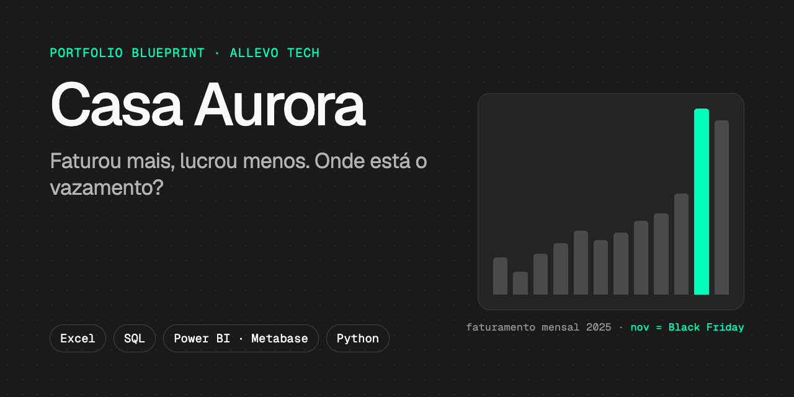
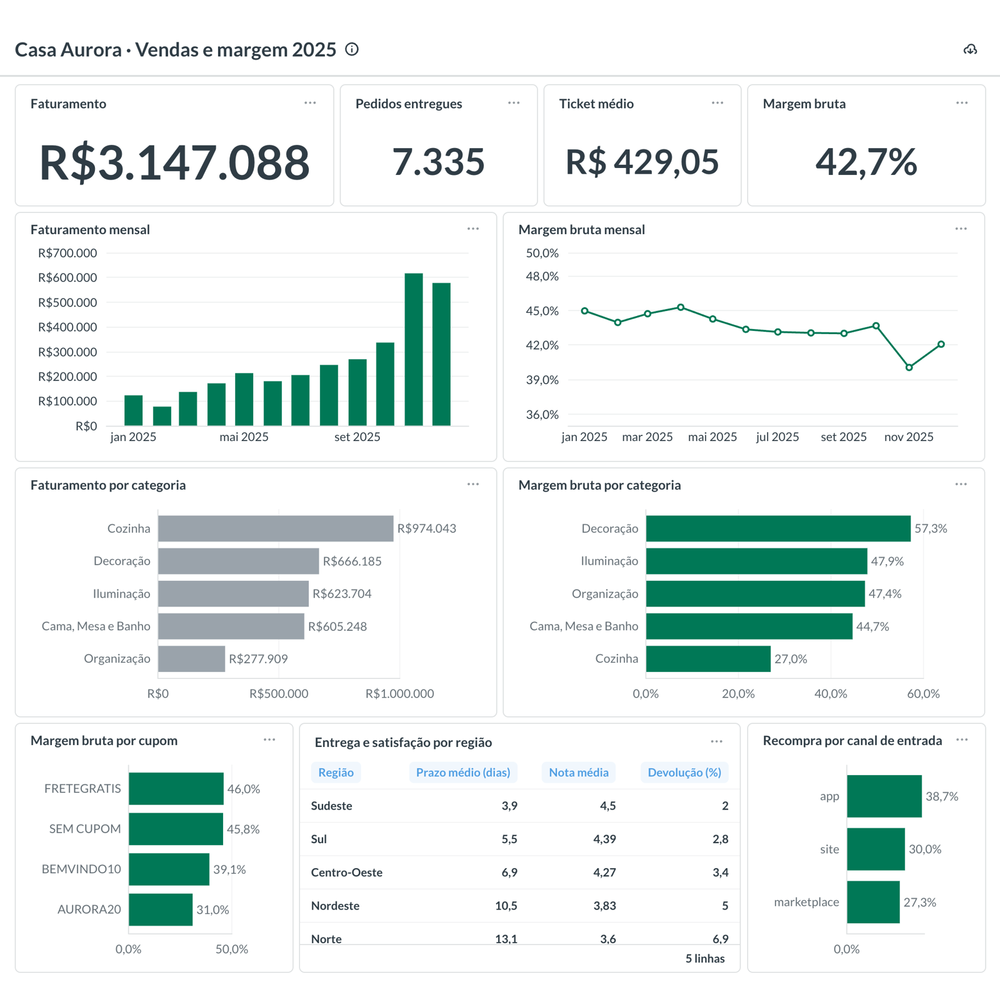

<p align="center">
  
</p>

<p align="center">
  <a href="https://colab.research.google.com/github/allevotech/casa-aurora-analise/blob/main/notebooks/01_sql_duckdb.ipynb"></a>
  &nbsp;
  <a href="https://colab.research.google.com/github/allevotech/casa-aurora-analise/blob/main/notebooks/02_python_analysis.ipynb"></a>
  &nbsp;
  
  
</p>

# Casa Aurora · projeto-modelo de portfólio em dados

Um projeto completo de análise de dados, do dado sujo à recomendação, para você **fazer, publicar e apresentar**. Faz parte do **Portfolio Blueprint**, bônus da [Formação Analista de Dados da Allevo Tech](https://allevotech.com.br/formacao-em-analista-de-dados/).

> A Casa Aurora é um e-commerce **fictício** de casa e decoração. Todos os dados foram gerados por script para estudo. Nenhuma empresa real está aqui.

## O desafio

> *"Em 2025 o faturamento cresceu, mas a margem caiu. Onde estamos perdendo dinheiro e o que fazer em 2026?"*
> — diretora comercial da Casa Aurora

Você é a pessoa de dados que vai responder. Os números escondem pelo menos 5 achados para você encontrar.

## O que você vai construir

<p align="center">
  
</p>

<sub>Dashboard de referência (Metabase). O seu pode ser em Power BI ou Metabase, com o seu estilo.</sub>

## O caminho, em 5 etapas

| Etapa | Ferramenta | Você entrega |
|---|---|---|
| 1 · Limpar e resumir | Excel ou Google Sheets | Base limpa + tabelas dinâmicas |
| 2 · Perguntar ao banco | SQL no Google Colab | 8 consultas que respondem perguntas de negócio |
| 3 · Montar o painel | Power BI ou Metabase | Dashboard de vendas e margem |
| 4 · Ir além *(opcional)* | Python no Google Colab | Gráficos + um teste estatístico |
| 5 · Publicar | GitHub + LinkedIn | Este repositório com o **seu** README |

Cerca de 25 minutos por dia, em 21 dias. Os enunciados e o plano dia a dia estão na plataforma da Allevo Tech.

## Como usar este modelo

1. Clique em **Use this template → Create a new repository** (no topo desta página) e crie o seu repositório, **público**.
2. Abra os notebooks pelos botões **Open in Colab** acima. Não precisa instalar nada.
3. No fim do projeto, apague este `README.md`, renomeie o [`README-template.md`](README-template.md) para `README.md` e preencha com a sua análise.
4. Coloque o print do seu dashboard em `images/dashboard.png`.

## O que tem aqui

```
casa-aurora-analise/
├── data/
│   ├── raw/casa_aurora_raw.xlsx   ← etapa 1: export "do sistema", com sujeira de propósito
│   └── clean/*.csv                ← etapas 2 a 4: 4 tabelas limpas
├── notebooks/                     ← SQL e Python, prontos para o Colab
├── sql/                           ← salve aqui as suas consultas
├── dashboard/metabase/            ← script que carrega os dados no PostgreSQL
├── images/                        ← print e GIF do seu dashboard
├── data-dictionary.md             ← o que significa cada coluna
├── README-template.md             ← o modelo do SEU README
└── docker-compose.yml             ← Metabase + PostgreSQL com um comando (opcional)
```

| Tabela | Linhas | O que é |
|---|---|---|
| `customers` | 5.000 | Clientes, UF, região, canal de aquisição |
| `products` | 120 | Catálogo com categoria e custo |
| `orders` | 7.868 | Pedidos de 2025: canal, cupom, prazo, status, nota |
| `order_items` | 19.554 | Itens de cada pedido: quantidade, preço, desconto |

Detalhes no [dicionário de dados](data-dictionary.md).

## Metabase no seu computador (opcional)

Para quem não usa Windows (o Power BI Desktop só roda nele):

```bash
cp .env.example .env      # troque a senha dentro do arquivo
docker compose up -d      # abre o Metabase em http://localhost:3000
```

No Metabase, conecte o banco **PostgreSQL**: host `db`, porta `5432`, banco `casa_aurora`, usuário `aurora` e a senha do seu `.env`.

---

<p align="center"><sub>Portfolio Blueprint · Kit de Carreira em Dados · <a href="https://allevotech.com.br">Allevo Tech</a> · dados sintéticos para estudo</sub></p>
